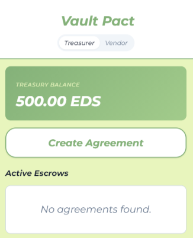
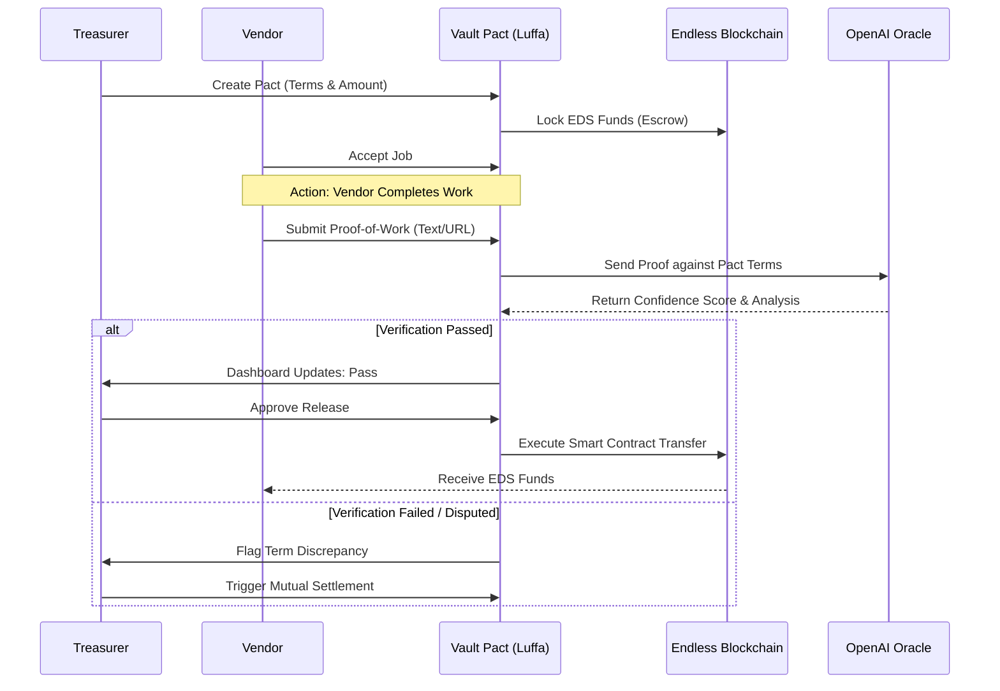

# Vault Pact

### 🏅 Encode Club AI Hackathon

<p align="center">
  Frontend built with:<br>
  
  
  
  <br>
  Backend & AI built with:<br>
  
  
  
</p>

## HERO SECTION
<p align="center">
  
  <!-- Add screenshot here -->
</p>

Vault Pact is a decentralized escrow platform that secures society funds on the Endless Blockchain, using AI-driven verification to ensure vendor work is completed safely before payments are released. By automating the relationship between Treasurers and Vendors, we eliminate "trust-gap" delays and secure club spending through a transparent, immutable ledger. **Traditional club treasury systems rely on manual, multi-day bank transfers and opaque vetting; Vault Pact reduces verification time to seconds while maintaining 100% financial security.**

## WHAT IT DOES
The platform provides a secure bridge for societies to hire vendors with guaranteed protection. Treasurers lock funds in a smart-contract escrow, which are only released once the AI Oracle validates the vendor's proof-of-work against the agreed-upon terms.

*   **Smart Fund Locking**: Secure, instant fund locking on the Endless Blockchain via Luffa SuperBox.
*   **AI Proof Oracle**: Powered by GPT-4o-mini to analyze receipts, photos, and justifications against contract requirements.
*   **Role-Based Access**: Dedicated interfaces for Treasurers (management/approval) and Vendors (proof submission).
*   **Mutual Settlement Flow**: Integrated dispute resolution system that allows for manual overrides or instant refunds.
*   **Auditability**: Complete, immutable history of agreements, proof-of-work, and release statuses.

## ARCHITECTURE / HOW WE BUILT IT


### Tech Stack
*   **Frontend**: 
    *   **WeChat Mini Program (WXML/WXSS/JS)**: Chosen for its seamless integration with the Luffa SuperBox ecosystem and high accessibility for mobile users.
    *   **Montserrat & Consolas Typography**: Selected for a premium, developer-centric aesthetic and technical clarity.
*   **Backend & Blockchain**:
    *   **Endless Blockchain (EDS)**: Provides the low-latency, decentralized settlement layer for all escrow transactions.
    *   **Luffa SuperBox SDK**: The core bridge for wallet connection, message signing, and transaction packaging.
*   **AI / Machine Learning**:
    *   **OpenAI GPT-4o-mini**: Acts as the "AI Oracle" to process unstructured vendor proof and provide confidence scores against agreement requirements.
*   **Infrastructure**:
    *   **WeChat DevTools**: The primary development and simulation environment for mobile mini-programs.

## GETTING STARTED
### Prerequisites
*   WeChat DevTools (Stable version)
*   Endless Wallet (Luffa SuperBox compatible)
*   OpenAI API Key

### Installation
```bash
git clone https://github.com/Harlex-art/clubfund-escrow.git
cd vault-pact
# Open the project in WeChat DevTools
```

### Environment Variables
Configure your OpenAI API Key in `pages/index/index.js` (or move to a cloud function for production):
```javascript
// In pages/index/index.js
const OPENAI_API_KEY = "your_openai_api_key_here";
```

### How to Run
1. Open the project in **WeChat DevTools**.
2. Click **"Compile"** to build the mini-program.
3. Use the **Simulator** to switch between Treasurer and Vendor roles for testing.
4. Note: Real wallet interactions will require the Luffa SuperBox on a physical device.

## KEY FEATURES
*   **Decentralized Escrow**: Safe and instant fund locking on the Endless Blockchain.
*   **AI-Proof Oracle**: GPT-4o-mini analysis for cross-referencing vendor justification with contract terms.
*   **Simulator Mocking**: Custom-built mocking layer for Luffa SDK signatures to allow for full demo flows in the WeChat DevTools IDE.
*   **Dynamic Balance Display**: Treasury state that updates in real-time as funds are locked, approved, or refunded.
*   **Privacy-First AI**: Sensitive AI analysis internal thoughts and confidence scores are restricted to the Treasurer view only.

## CHALLENGES AND LEARNINGS
*   **SDK-Simulator Interop**: We overcame hardware dependencies in the Luffa SDK by building a platform-aware mocking layer, enabling a full "Showcase Mode" within the simulator.
*   **Prompt Engineering**: Fine-tuning the AI Oracle to strictly validate vendor proof against "Zero-Trust" requirements was a major technical hurdle.
*   **Key Learnings**: We mastered the WeChat Mini Program lifecycle and learned how to orchestrate multi-agent LLM systems for autonomous financial triggers.

## WHAT'S NEXT
1.  **Direct Smart Contract Deployment**: Moving from simulated logic to fully deployed Endless Move smart contracts.
2.  **Multi-Sig Integration**: Requiring multiple club executives to approve large treasury disbursements.
3.  **Image-Based Proof**: Enhancing the AI Oracle to process raw photos of event setups or deliverables using vision models.

## TEAM / CONTRIBUTORS
*   **John** - Developer - [@Harlex-art](https://github.com/Harlex-art)
*   **Aditya** - Developer - [@Aditya-47](https://github.com/Aditya-47)

## LICENSE
MIT License
